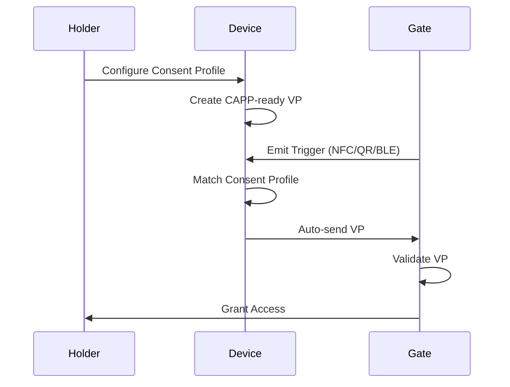

# CAPP Specification

**Title**: Contextual Authentication Presentation Protocol (CAPP)  
**Author**: Ace Shim (Hopae Inc.)  
**Status**: Draft v0.1  
**Last Updated**: 2025-06-12

## Abstract
CAPP is a decentralized presentation protocol for Verifiable Credentials that enables frictionless, context-triggered, pre-consented credential sharing without requiring interactive challenge-response cycles. It is optimized for physical access, transit, event entry, and other passive authentication scenarios.


## 1. Introduction

The use of Verifiable Credentials (VCs) often requires a verifier-issued challenge, user interaction, and roundtrip communication. CAPP introduces a passive, context-aware presentation flow based on a Consent Profile locally maintained by the Holder.

CAPP is purpose-built for physical and routine authentication scenarios where users should not be required to approve every interaction explicitly. It allows for seamless, automatic credential presentation based on pre-defined conditions (e.g., location, time, trigger signal).

### Example Use Cases

- **Building Access**: An employee walks into the office building and passes through the turnstile without tapping or confirming—CAPP presents a purpose-bound VP to the verifier as the user approaches the gate.

- **Airport Boarding Gate**: A traveler approaches a boarding gate and their flight ticket credential is automatically presented via NFC. The gate verifies the credential and opens without requiring an app launch or manual scan.

- **Event Entry (e.g., Concert, Conference)**: A guest scans a QR or simply walks past a beacon-enabled entry point. Their ticket credential is auto-submitted without needing approval at every event checkpoint.

- **Subway and Transit Access**: A metro rider walks through the gate using a digital transit pass wallet that pushes the credential passively via BLE or QR.

- **Smart Gym/Workspace Entry**: Members are authenticated passively using a pre-agreed consent profile when entering via phone/watch.

- **Healthcare Check-In**: A returning patient’s insurance credential is passively presented to the hospital kiosk, confirming identity and coverage.

These scenarios share a common trait: **the need for high trust, low interaction, and rapid flow**, especially in environments where users may not have their phone in hand or time to respond to popups. CAPP enables this level of frictionless trust.
The use of Verifiable Credentials (VCs) often requires a verifier-issued challenge, user interaction, and roundtrip communication. CAPP introduces a passive, context-aware presentation flow based on a Consent Profile locally maintained by the Holder.

## 2. Terminology
- **Holder**: Entity that owns and controls credentials
- **Verifier**: Entity requesting and verifying a credential
- **CAPP-ready**: A VP that has been pre-constructed, bound to a specific context and purpose
- **Consent Profile**: A user-defined policy specifying disclosure conditions
- **Trigger**: QR/NFC/URI or any other physical/digital signal initiating VP flow


## 3. Protocol Overview
1. **Preparation**
   - Holder creates a Verifiable Presentation
   - VP includes audience (aud), purpose, expiration (exp), nonce
   - Consent Profile is configured on device

2. **Trigger**
   - Verifier emits a signed trigger (e.g. QR/NFC with `capp://` URI)

3. **Consent Profile Matching**
   - Holder's device evaluates verifier, time, purpose, and context match

4. **Automatic Presentation**
   - VP sent to verifier endpoint (HTTPS or DIDComm)
  
## 4. Flow Diagram

## 5. Examples

### 5-1. Consent Profile Example
```json
{
  "verifier": "did:example:building",
  "purpose": "building-entry",
  "location": "166 Geary St, SF",
  "timeWindow": "08:00–18:00",
  "autoPresent": true,
  "disclosurePolicy": "minimal"
}
```


### 5-2. VP Payload Format
```json
{
  "type": ["VerifiablePresentation", "CAPPPresentation"],
  "holder": "did:example:holder123",
  "verifiableCredential": ["<VC or SD-JWT>"],
  "purpose": "building-entry",
  "aud": "did:example:corp-building",
  "exp": "2025-06-12T09:30:00Z",
  "nonce": "f8a8...x3b",
  "proof": {
    "type": "Ed25519Signature2020",
    "created": "2025-06-12T08:45:00Z",
    "verificationMethod": "did:holder#key-1",
    "proofPurpose": "authentication"
  }
}
```

## 6. Security Considerations

CAPP is designed to optimize user experience and reduce interaction burden, but this naturally introduces **new threat surfaces** compared to traditional challenge-response protocols. Therefore, its security architecture must account for potential risks arising from verifier spoofing, VP replay, consent tampering, and device-level threats.

### 6.1 Replay Attack Mitigation
- **Nonce (`jti`)** and **Expiration (`exp`)** fields are REQUIRED in all CAPP-ready Verifiable Presentations.
- Presentations must have a short TTL (e.g., < 5 minutes) and be **ephemeral**.
- Verifiers SHOULD reject identical VP payloads if observed within a replay window.

### 6.2 Verifier Spoofing Defense
- Trigger payloads (e.g., capp:// URIs) MUST be **digitally signed** by the verifier using a key published in a DID Document or OIDC metadata.
- Holder device MUST verify the signature prior to evaluating Consent Profile or presenting VP.
- Devices MAY cache trusted verifiers with expiration for performance but MUST revalidate regularly.

### 6.3 Consent Profile Integrity and Protection
- Consent Profiles MUST be **stored in encrypted local storage**, ideally within a secure enclave (TEE, Keychain, Android Keystore).
- Modification of a Consent Profile SHOULD require **user re-authentication** (PIN, biometrics).
- Profiles MUST be scoped: each profile binds to a specific `verifier` and `purpose`.

### 6.4 Device Theft or Loss Mitigation
- VP generation and transmission SHOULD be gated behind **user presence signals**, especially on first use in a session.
- Passive presentation MAY be disabled by default until explicitly activated.
- Emergency "panic" revocation switch (e.g., via cloud sync or kill-switch) SHOULD be available.

### 6.5 Purpose Binding and Contextualization
- VPs MUST include a `purpose` claim.
- Verifiers MUST validate that the purpose aligns with expected behavior (e.g., `building-entry` or `event-checkin`).
- This reduces the risk of **purpose repurposing**, where the same VP is used outside its intended domain.

### 6.6 Linkability and Correlation Controls
- To protect user privacy and minimize trackability:
  - Use **pairwise DIDs** or rotating identifiers
  - Strip unnecessary metadata (e.g., timestamps) unless required by verifier
  - Avoid using long-lived subject identifiers

### 6.7 Verifier Endpoint Security
- CAPP verifier endpoints MUST implement TLS (HTTPS) with modern ciphers.
- Verifiers MUST validate:
  - VP signature
  - Credential status (via revocation or status list)
  - Binding to purpose, audience, and temporal validity

### 6.8 Passive Channel Protections
- BLE/NFC/QR payloads MUST:
  - Be short-lived and non-reusable
  - Avoid containing PII directly
  - Use signed JWT or hash pointers to reduce leakage risk

### 6.9 Auditability
- Holders SHOULD be able to view a history of auto-presented VPs per profile
- Devices SHOULD log VP usage securely and offer users revocation or pause mechanisms

## 7. Extensions
- Compatibility with `presentation_definition.profile = "capp"`
- VC API 2.0 extensions to handle `triggered_presentation`
- Support for secure passive triggers (e.g. BLE beacon with ephemeral URI)

## 8. Compatibility
- W3C VC Data Model
- SD-JWT and BBS+ signatures
- DIDComm v2 or HTTPS POST
- Selective Disclosure JWT (SD-JWT VC)

## 9. Licensing
MIT License © 2025 Hopae Inc.

## 10. Feedback
Submit issues and pull requests at:  
[https://github.com/hopae-official/capp-spec](https://github.com/hopae-official/capp-spec)
